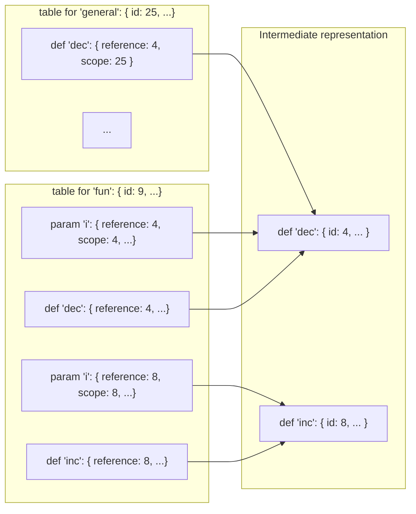
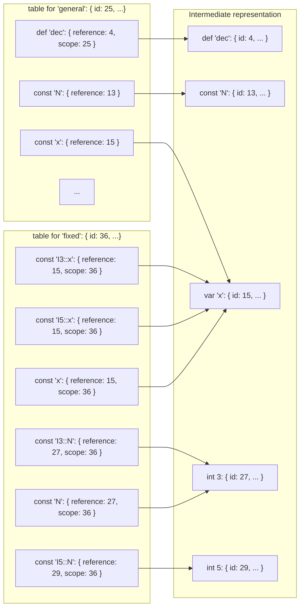

# ADR006: Design of modules and lookup tables

| Revision | Date       | Author           |
| :------- | :--------- | :--------------- |
| 1        | 01.03.2023 | Igor Konnov      |

<!-- 
This ADR is written as a literate programming document, preprocessed by:

https://github.com/driusan/lmt
-->

## 1. Summary

We propose a new syntax for modules and instances. Since this discussion was
motivated by the implementation, we propose a minimal API for organizing
various static information, including lookup tables.

## 2. Context

The module system for Quint has always been the second priority. It was mainly
designed after TLA<sup>+</sup> modules and instances, with a few cosmetic
fixes. In the recent attempts to implement instances and lookup tables, we have
found that our intuition around the behavior of modules and instances starts to
break. Hence, we have decided to redesign this part of the language and the
related parts of the implementation.

### 2.1. Current approach

#### 2.1.1. Modules and imports

We encapsulate pure functional definitions in a distinct module (called `fun`
below), and import its definitions in the module that specifies the general
behavior of the state machine (called `general` below):

```scala generated/adr006before.qnt +=
module fun {
  pure def dec(i) = i - 1
  pure def inc(i) = i + 1
}

module general {
  import fun.*

  // to be defined later
<<<definitions>>>
}
```

Currently, the lookup tables for `fun` and `general` look like that:




We define constants, variables, and actions of `general` as follows:


```scala "definitions" +=
  const N: int
  var x: int

  action init = x' = N
  action step = x' = dec(x)
```

#### 2.1.2. Instances

Having defined `general`, we define its fixed-size instances in the module
`fixed`:

```scala generated/adr006before.qnt +=
module fixed {
  module I3 = general(N = 3)
  module I5 = general(N = 5)

  action init3 = I3::init
  action init5 = I5::init

  import I3.*
}
```

We do not give detailed lookup tables here, as they tend to get too large too
fast.  We only highlight the essential parts of the lookup tables:



### 2.3. Deficiencies in the current design

Let us summarize all kinds of issues that we are experiencing with the current
design.

#### 2.3.1. D1: No identifiers for operator parameters

Let's have a look at the lookup table of `fun` that contains two parameter
names, both called `i`. The operator parameters do not have their own
identifiers. As a result, both lookup entries for `i` refer to the identifiers
of their encompassing definitions, called `def` and `inc`, respectively.
Hence, it is currently hard to refer to an operator parameter. Instead of
referring to a parameter directly, we have to use the pair $(definitionId,
parameterName)$.

#### 2.3.2. D2: Using `Map[string, ValueDefinition]` for lookup

This is how a lookup table is currently defined:

```ts
export interface LookupTable {
  /* Names for operators defined */
  valueDefinitions: Map<string, ValueDefinition[]>
  /* Type aliases defined */
  typeDefinitions: Map<string, TypeDefinition[]>
}
```

The `ValueDefinition` is defined as follows:

```ts
export interface ValueDefinition {
  /* Same as QuintDef kinds */
  kind: ValueDefinitionKind
  /* The name given to the defined operator */
  identifier: string
  /* Expression or definition id from where the name was collected */
  reference?: bigint
  /* Optional scope, an id pointing to the QuintIr node that introduces the name */
  scope?: bigint
  /* Optional type annotation */
  typeAnnotation?: QuintType
}
```

The most obvious issue is that names are not unique identifiers in a module,
since operators may have parameters and nested definitions that carry the same
names. This is illustrated by the definitions of `inc` and `dec` in the module
`fun`.

To deal with this issue, `ValueDefinition` contains an optional identifier
called `scope`. This identifier is used to filter out the potential name
clashes. This filtering happens on every lookup, which potentially slows down
large specification. We could have done it once in the name resolution stage.

#### 2.3.3. D3: No distinction between variables produced by multiple instances

The lookup tables are currently tuned towards particular kinds of analysis such
as type checking. They are not general enough to work other kinds of stages
such as simulation: For simulation and translation to Apalache, it is important
that `I3::x` and `I5::x` point to two different versions of `x`, whereas they
currently point to the same variable.

#### 2.3.4. D4: Confusing syntax of module instances

Recall how we produced new instances in our example:

```scala
module general {
  module I3 = general(N = 3)
  module I5 = general(N = 5)
  ...
}
```

In the earlier versions of the language, `I3` and `I5` were indeed treated as
modules. We have decided to remove support for nested modules in the issue
[#548](https://github.com/informalsystems/quint/issues/548).  As a consequence
of this decision, the syntax of instances became surprising: It refers to the
concept that is not supported by the language anymore.

## 3. Options

TBD


## 4. Solution

### 4.3.1. Addressing D1

To address the issue D1, we propose to simply introduce identifiers in the
operator parameters. This rework is planned in [issue
624](https://github.com/informalsystems/quint/issues/624).


