**modules:**

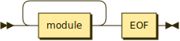

**module:**

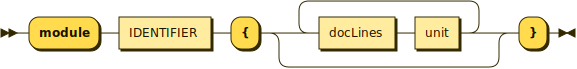

referenced by:

* modules
* unit

**docLines:**

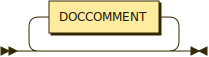

referenced by:

* module

**unit:**

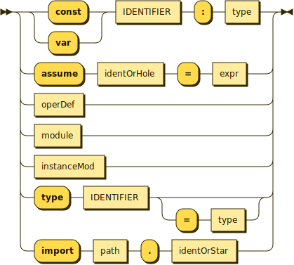

referenced by:

* module
* unitOrExpr

**operDef:**

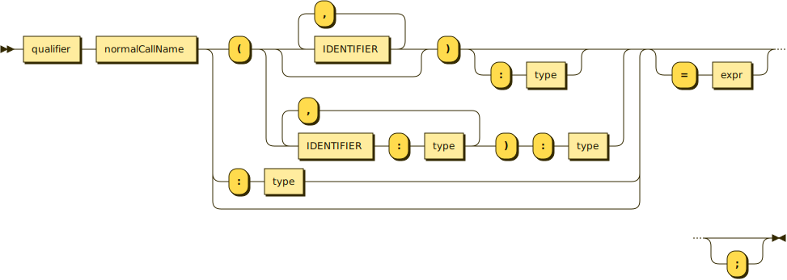

referenced by:

* expr
* unit

**qualifier:**

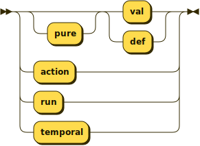

referenced by:

* operDef

**instanceMod:**

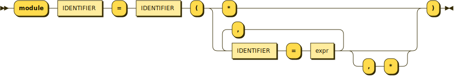

referenced by:

* unit

**type:**

referenced by:

* expr
* operDef
* row
* type
* unit

**typeUnionRecOne:**

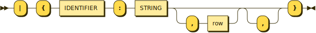

referenced by:

* type

**row:**

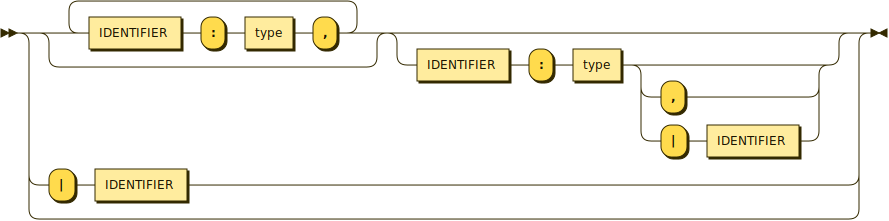

referenced by:

* type
* typeUnionRecOne

**expr:**

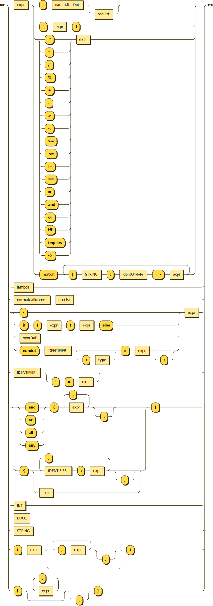

referenced by:

* argList
* expr
* instanceMod
* lambda
* operDef
* unit
* unitOrExpr

**unitOrExpr:**

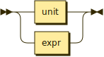

**lambda:**

referenced by:

* expr

**identOrHole:**

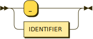

referenced by:

* expr
* lambda
* unit

**identOrStar:**

referenced by:

* unit

**path:**

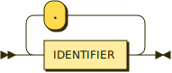

referenced by:

* unit

**argList:**

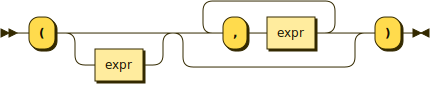

referenced by:

* expr

**normalCallName:**

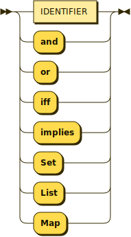

referenced by:

* expr
* operDef

**nameAfterDot:**

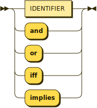

referenced by:

* expr

**literal:**

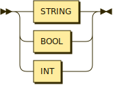

**_:**

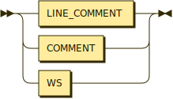

**STRING:**

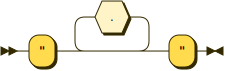

referenced by:

* expr
* literal
* typeUnionRecOne

**BOOL:**

referenced by:

* expr
* literal

**INT:**

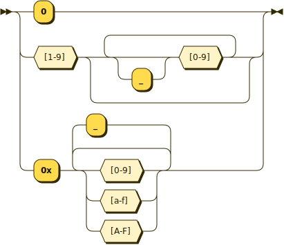

referenced by:

* expr
* literal

**IDENTIFIER:**

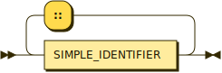

referenced by:

* expr
* identOrHole
* identOrStar
* instanceMod
* module
* nameAfterDot
* normalCallName
* operDef
* path
* row
* type
* typeUnionRecOne
* unit

**SIMPLE_IDENTIFIER:**

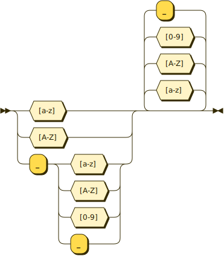

referenced by:

* IDENTIFIER

**DOCCOMMENT:**

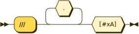

referenced by:

* docLines

**LINE_COMMENT:**

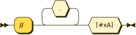

referenced by:

* _

**COMMENT:**

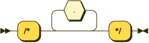

referenced by:

* _

**WS:**

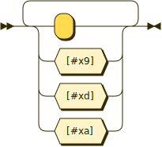

referenced by:

* _

**EOF:**

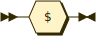

referenced by:

* modules

## 
 generated by [RR - Railroad Diagram Generator][RR]

[RR]: http://bottlecaps.de/rr/ui