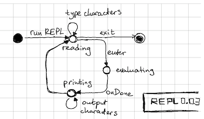
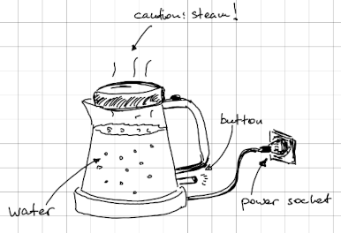
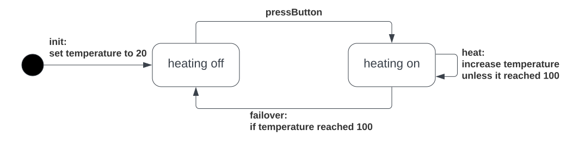
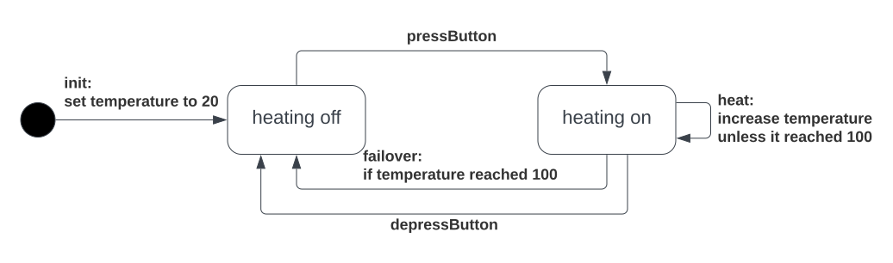
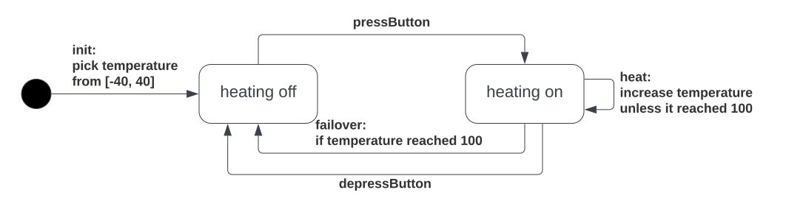

# REPL: Read-eval-print loop for TNT

| Revision | Date       | Author           |
| -------: | :--------: | :--------------- |
| 2        | 09.12.2022 | Igor Konnov      |

[REPL][] is a read-eval-print loop. A REPL is usually a good way to start
learning a language.

Most likely, you have seen REPL before. If you had not, here is a simple
state machine that describes how it works from the user's point of view:



# Table of contents

  * [1. Installation](#1-installation)
  * [2. Running REPL](#2-running-repl)
  * [3. Evaluating expressions](#3-evaluating-expressions)
  * [4. Introducing values and definitions](#4-introducing-values-and-definitions)
  * [5. Describing a state machine](#5-describing-a-state-machine)
    + [5.1. Introducing state variables](#51-introducing-state-variables)
    + [5.2. Initializing state variables](#52-initializing-state-variables)
    + [5.3. Updating state variables with actions](#53-updating-state-variables-with-actions)
    + [5.4. Introducing control non-determinism](#54-introducing-control-non-determinism)
    + [5.5. Introducing data non-determinism](#55-introducing-data-non-determinism)
  * [6. Saving and loading the REPL session](#6-saving-and-loading-the-repl-session)
  * [7. Executing runs](#7-executing-runs)
  * [8. Testing invariants and random walking](#8-testing-invariants-and-random-walking)
  * [9. Further reading](#9-further-reading)

## 1. Installation

You have to install `tntc` first. See [README](../tntc/README.md).

## 2. Running REPL

Simply run the following command in the terminal:

```sh
$ tntc repl
```

You will see the following output:

```sh
TNT REPL vN.N.N
Type ".help" for more information
>>>
```

You can type `.help` and then press `<ENTER>` to see the house rules.

## 3. Evaluating expressions

The most basic thing we can do in REPL is to enter an expression and get the
result of its evaluation. Like this: 

```sh
>>> 1 + 3
4
```

Or like this:

```sh
>>> Set(1, 2, 3).map(i => i * 2)
Set(2, 4, 6)
```

## 4. Introducing values and definitions

Typing everything in a single expression can become tedious very quickly. To
avoid that, you can introduce top-level definitions, which will be saved in the
REPL context. For instance:

```sh
>>> val boilingTemperature = 100

>>> val freezingTemperature = 0

>>> def fahrenheit(celcius) = celcius * 9 / 5 + 32

```

We can use the values and definitions in the expressions later:

```sh
>>> fahrenheit(freezingTemperature)
32
>>> fahrenheit(boilingTemperature)
212
>>> 0.to(100).exists(celsius => fahrenheit(celsius) == celsius)
false
>>> -100.to(100).exists(celsius => fahrenheit(celsius) == celsius)
true 
>>> val veryCold = fahrenheit(-40)
>>> veryCold
-40
>>> val veryHot = fahrenheit(40)
>>> veryHot
104
```

## 5. Describing a state machine

In its basic form, REPL allows us to evaluate expressions, which make it a
great tool for learning the language. But REPL can do more for you: It can
simulate a state machine. In this section, we interactively specify a model of
an electric kettle:



Informally, we can describe the most basic operation of a kettle like the one
above with the following [state machine][]:



If you think, this diagram is not very realistic, you are right. We will extend
it later.


### 5.1. Introducing state variables

Similar to definitions, we introduce state variables:

```sh
>>> var temperature: int

>>> var heatingOn: bool

>>> var beeping: bool

```

By default, a state variable is not assigned any value. Hence, any use of
`temperature` would produce a runtime error:

```sh
>>> temperature
runtime error: <input>:0:1 - error: Variable temperature is not set
0: var temperature: int
   ^^^^^^^^^^^^^^^^^^^^

<result undefined>
```

### 5.2. Initializing state variables

Undefined state variables are not very useful. Hence, we have to introduce an
action to initialize the state machine and move it forward. For instance, here
is how we initialize our kettle:

```sh
action init = all {
  temperature' = 20,
  heatingOn' = false,
  beeping' = false,
}
```

The action `init` is just an action definition, which can be applied later. To
apply it, we simply type `init`:

```sh
>>> init
true
```

Note that REPL has evaluated this action to `true`. It means that the action
has taken place. If it was evaluated to `false`, it would mean that something
prevented the action from being applied; more on that later.

Now we can check that `init` has indeed initialized the state variables as
expected:

```sh
>>> temperature
20
>>> heatingOn
false
```

### 5.3. Updating state variables with actions

Similar to how we introduced `init`, we introduce the action `pressButton`,
which turns on the heating element of our kettle.

```sh
action pressButton = all {
  not(heatingOn),
  heatingOn' = true,
  beeping' = false,
  temperature' = temperature,
}
```

Again, we have just defined the action `pressButton`, but that action
is not applied automatically. To apply it, we simply type its name:

```sh
>>> pressButton
true
```

We can evaluate the state variable `heatingOn` to make sure that the action
indeed took place:

```sh
>>> heatingOn
true
```

Interestingly, if we try to apply `pressButton` once again, it would not
work, as indicated by the `false` result:

```sh
>>> pressButton
false
```

Indeed, we do not allow the button to be pressed again, if the heating is
already on. In a physical kettle this is usually done mechanically, but in the
abstract world of specs it is up to us, whether we allow for this behavior or
not.

Similar to `pressButton`, we can define the `failover` action that turns off
the kettle when the temperature reaches 100. If the value 100 makes you
puzzled, call `fahrenheit(100)` in REPL ;-)

```sh
action failover = all {
  heatingOn,
  temperature >= 100,
  heatingOn' = false,
  beeping' = true,
  temperature' = temperature,
}
```

If we apply `failover` to the current state, it will not execute:

```sh
>>> failover
false
```

Indeed, `temperature` is equal to 20 in the current state of REPL:

```sh
>>> temperature
20
```

To properly test `failover`, we should probably define the action `heat`
in our spec. But since we are in REPL, we can also take a shortcut, by
simply setting the state variables to the state we need:

```sh
>>> all { temperature' = 100, heatingOn' = true, beeping' = false }
true
```

By doing so, we have executed an action expression, which has set `temperature`
to 100, `heatingOn` to `true`, and `beeping` to `false`. (You can double check
that by evaluating the variables.) Note that not only we had to set the value
of `temperature`, but also the values of `heatingOn` and `beeping`. If we had
not done that, the values of `heatingOn` and `beeping` would have become
undefined.

Now we can apply `failover`:

```
>>> failover
true
>>> heatingOn
false
>>> temperature
100
>>> beeping
true
```

To reset the state to the previous one, we can simply evaluate `init` and
`pressButton` again (there is a better way to do that, which we will show
later):

```sh
>>> init
true
>>> pressButton
true
```

Now it is time to specify the action `heat`:

```sh
action heat = all {
  heatingOn,
  temperature < 100,
  temperature' = temperature + 1,
  heatingOn' = true,
  beeping' = false,
}
```

By applying `heat` several times, we can see that it heats up the kettle a bit:

```sh
>>> heat
true
>>> temperature
21
>>> heat
true
>>> temperature
22
>>> heat
true
>>> temperature
23
```

<a id="controlNondet"></a>
### 5.4. Introducing control non-determinism

So far, our specification of a kettle had only one action that turns the
heating element off, namely, the `failover` action. Normally, a kettle can be
turned off without waiting until it boils to 100C. Hence, we add one more
action `depressButton` in our diagram:



This action should be easy to define:

```sh
action depressButton = all {
  heatingOn,
  heatingOn' = false,
  temperature' = temperature,
  beeping' = false,
}
```

Now we can execute four actions and observe that we managed to heat the kettle
by 1 degree and turn it off:

```sh
>>> init
true
>>> pressButton
true
>>> heat
true
>>> depressButton
true
>>> heatingOn
false
>>> temperature
21
```

Notice that our specification allows for a new interesting behavior. Evaluate
the following expressions:

```sh
>>> all { heatingOn' = true, temperature' = 100, beeping' = false }
true
>>> depressButton
true
>>> (heatingOn, temperature, beeping)
(false, 100, false)
>>> all { heatingOn' = true, temperature' = 100, beeping' = false }
true
>>> failover
true
>>> (heatingOn, temperature, beeping)
(false, 100, true)
```

As we can see, both `depressButton` and `failover` can apply when the
temperature reaches 100. This makes sense in real life. If the temperature
sensor in your kettle has not registered 100 degrees yet, and you depress the
button, the heating element turns off. We do not want to introduce unnecessary
details about precise time measurements and the physical processes in the
kettle, so from our perspective both `failover` and `depressButton` may happen
at the same time.

You can ask the question, whether it makes any difference when `depressButton`
or `failover` are applied. Actually, it does: `failover` sets `beeping` to
`true`, whereas `depressButton` sets `beeping` to `false`. Where did you get a
beeping kettle from, Igor? Well, I bought a "smart" kettle, and nobody told me
that it would beep in the middle of the night, when I would like to make a cup
of tea. It's all good, I bought a "not-so-smart" kettle that is not beeping.

How do we describe in the specification that one of the actions may apply,
whichever happens first, and we do not control which one? TNT has the operator
`any` to do exactly this:

```sh
any {
  depressButton,
  failover,
}
```

The REPL implementation chooses one of the enabled actions pseudo-randomly.
But in general, the language does not prescribe one way of choosing between
simulteneously enabled actions. So we prefer saying that TNT evaluates `any {
... }` non-deterministically. To be precise, `any { ... }` describes *control
non-determinism*, that is, it chooses how to continue the flow, but each of our
actions behaves deterministically, like a program. We could also introduce
non-determinism in the choice of data, see [Data non-determinism](#dataNondet)
below.

Now it is time to define all possible transitions of the kettle in one place:

```scala
action step = any {
  pressButton,
  heat,
  depressButton,
  failover,
}
```

Having defined `step`, we can conveniently execute steps without specifying
the action that should be executed next:

```sh
>>> init
true
>>> step
true
>>> step
true
>>> step
true
>>> step
true
>>> (heatingOn, temperature, beeping)
(false, 22, false)
```

**Exercise**. Figure out how REPL ended up in the above state.

At some point, you may want to save particular sequences of actions.
To see how to do it, read about [Runs](#runs).

<a id="dataNondet"></a>
### 5.5. Introducing data non-determinism

If we look back at how we computed the initial state of our kettle, its
temperature is always set to 20 (Celcius). Most likely, you are using your
kettle under different temperatures too. Let's update the state diagram,
to reflect the reality a bit better:



I never tried to melt ice with an electric kettle, but it should probably work
as expected?

It looks like we have to describe multiple initial states that differ in the
temperature. This is how we can do that in TNT:

```
action initNondet = all {
  heatingOn' = false,
  nondet temp = -40.to(40).oneOf()
  temperature' = temp,
  beeping' = false,
}
```

Let's see how it works:

```sh
>>> initNondet
true
>>> (heatingOn, temperature, beeping)
(false, -36, false)
>>> initNondet
true
>>> (heatingOn, temperature, beeping)
(false, 28, false)
>>> initNondet
true
>>> (heatingOn, temperature, beeping)
(false, -16, false)
```

As you can see, `initNondet` does what we wanted: It chooses the initial
temperature from the interval `[-40, 40]` and sets `heatingOn` and
`beeping` to `false`. The magic is done by the special syntax form of TNT
that looks like follows:

```
nondet myElem = mySet.oneOf()
expr
```

REPL randomly picks one of the elements from the set `mySet` and binds the name
`myElem` to the chosen value. The name `myElem` can be used inside the
expression `expr`, which usually contains an assignment. Whereas REPL chooses a
set element pseudo-randomly, other implementations may do it differently. That
is why we say that the `nondet`-form implements *data non-determinism*.

## 6. Saving and loading the REPL session

At this point, we have introduced a lot of definitions. It would be great to
save them somewhere, so we do not have to type them again, if we accidentally
close REPL.

You can save the REPL session with the builtin command `.save`:

```sh
.save kettle.tnt
```

This command saves all definitions and evaluated expressions in a file.
You can edit this file in your editor of choice and load it back to REPL:

```sh
.clear
.load kettle.tnt
```

Note that if you start with a non-empty session, it's better to clear it with
the command `.clear` before loading the session from the file. Otherwise, REPL
may complain about conflicting definitions. If you want to combine definitions
from several files, you can execute several `.load` commands without `.clear`
between them.

If you tried to save and load your REPL sessions, you might have noticed that
the `.load` command replayed all the expressions you have typed so far.
In the current version, the expressions are saved inside comments, e.g.:

```
/*! (heatingOn, temperature, beeping) !*/
```

So if you do not want REPL to execute the previously typed expressions, you can
just remove them from the file. As a note, the format may change in the future.

<a id="runs"></a>
## 7. Executing runs

TODO

<a id="testing"></a>
## 8. Testing invariants and random walking

TODO

## 9. Further reading

TODO

[tnt repository]: https://github.com/informalsystems/tnt
[ts-node]: https://github.com/TypeStrong/ts-node
[REPL]: https://en.wikipedia.org/wiki/Read%E2%80%93eval%E2%80%93print_loop
[state machine]: https://en.wikipedia.org/wiki/UML_state_machine
