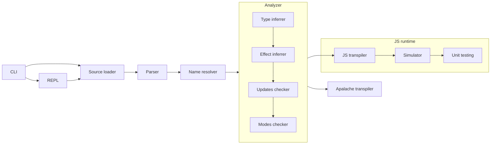
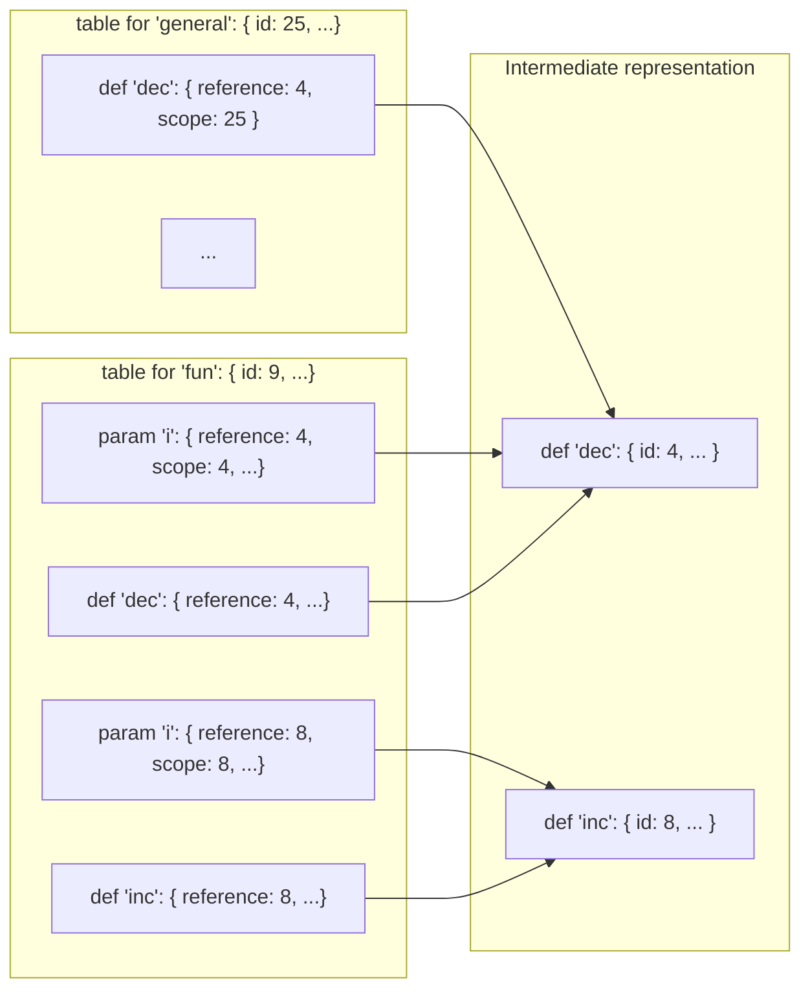
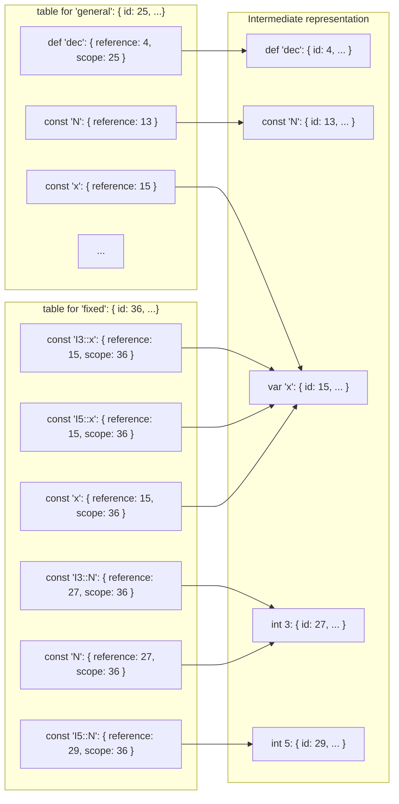
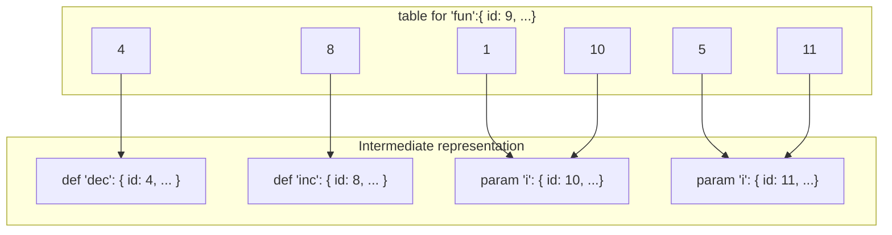
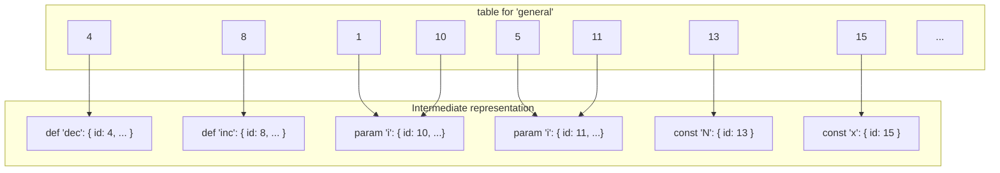
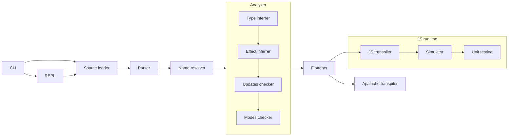

# ADR006: Design of modules and lookup tables

| Revision | Date       | Author           |
| :------- | :--------- | :--------------- |
| 3        | 2023-03-20 | Igor Konnov      |

<!-- 
This ADR is written as a literate programming document, preprocessed by:

https://github.com/driusan/lmt
-->

## 1. Summary

We propose a new syntax for modules and instances. Since this discussion was
motivated by the implementation, we propose a minimal API for organizing
various static information, including lookup tables.

## 2. Context

The module system for Quint has always been the second priority. It was mainly
designed after TLA<sup>+</sup> modules and instances, with a few cosmetic
fixes. In the recent attempts to implement instances and lookup tables, we have
found that our intuition around the behavior of modules and instances starts to
break. Hence, we have decided to redesign this part of the language and the
related parts of the implementation.

### 2.1. Current approach

From the high-level overview, the current pipeline looks as in the following
figure:




#### 2.1.1. Modules and imports

We encapsulate pure functional definitions in a distinct module (called `fun`
below), and import its definitions in the module that specifies the general
behavior of the state machine (called `general` below):

```quint generated/adr006before.qnt +=
module fun {
  pure def dec(i) = i - 1
  pure def inc(i) = i + 1
}

module general {
  import fun.*

  // to be defined later
<<<definitions>>>
}
```

Currently, the lookup tables for `fun` and `general` look like that:




We define constants, variables, and actions of `general` as follows:


```quint "definitions" +=
  const N: int
  var x: int

  action init = { x' = N }
  action step = { x' = dec(x) }
```

#### 2.1.2. Instances

Having defined `general`, we define its fixed-size instances in the module
`fixed`:

```quint generated/adr006before.qnt +=
module fixed {
  module I3 = general(N = 3)
  module I5 = general(N = 5)

  action init3 = I3::init
  action init5 = I5::init

  import I3.*
}
```

We do not give detailed lookup tables here, as they tend to get too large too
fast.  We only highlight the essential parts of the lookup tables:



### 2.3. Deficiencies in the current design

Let us summarize all kinds of issues that we are experiencing with the current
design.

#### 2.3.1. D1: No identifiers for operator parameters

Let's have a look at the lookup table of `fun` that contains two parameter
names, both called `i`. The operator parameters do not have their own
identifiers. As a result, both lookup entries for `i` refer to the identifiers
of their encompassing definitions, called `def` and `inc`, respectively.
Hence, it is currently hard to refer to an operator parameter. Instead of
referring to a parameter directly, we have to use the pair $(definitionId,
parameterName)$.

#### 2.3.2. D2: Using `Map[string, ValueDefinition]` for lookup

This is how a lookup table is currently defined:

```ts
export interface LookupTable {
  /* Names for operators defined */
  valueDefinitions: Map<string, ValueDefinition[]>
  /* Type aliases defined */
  typeDefinitions: Map<string, TypeDefinition[]>
}
```

The `ValueDefinition` is defined as follows:

```ts
export interface ValueDefinition {
  /* Same as QuintDef kinds */
  kind: ValueDefinitionKind
  /* The name given to the defined operator */
  identifier: string
  /* Expression or definition id from where the name was collected */
  reference?: bigint
  /* Optional scope, an id pointing to the QuintIr node that introduces the name */
  scope?: bigint
  /* Optional type annotation */
  typeAnnotation?: QuintType
}
```

The most obvious issue is that names are not unique identifiers in a module,
since operators may have parameters and nested definitions that carry the same
names. This is illustrated by the definitions of `inc` and `dec` in the module
`fun`.

To deal with this issue, `ValueDefinition` contains an optional identifier
called `scope`. This identifier is used to filter out the potential name
clashes. This filtering happens on every lookup, which potentially slows down
large specification. We could have done it once in the name resolution stage.
This is tracked in the issue
[#625](https://github.com/informalsystems/quint/issues/625).

#### 2.3.3. D3: No distinction between variables produced by multiple instances

The lookup tables are currently tuned towards particular kinds of analysis such
as type checking. They are not general enough to work other kinds of stages
such as simulation: For simulation and translation to Apalache, it is important
that `I3::x` and `I5::x` point to two different versions of `x`, whereas they
currently point to the same variable.

#### 2.3.4. D4: Confusing syntax of module instances

Recall how we produced new instances in our example:

```quint
module general {
  module I3 = general(N = 3)
  module I5 = general(N = 5)
  ...
}
```

In the earlier versions of the language, `I3` and `I5` were treated as modules.
We have decided to remove support for nested modules in the issue
[#548](https://github.com/informalsystems/quint/issues/548). As a consequence
of this decision, the syntax of instances became surprising: It refers to the
concept that is not supported by the language anymore.

The most obvious approach would be to replace the keyword `module` with
`instance`. However, the keyword `instance` seems to produce false expectations
that instances behave like objects. In Quint (as well as in TLA+), an instance
is a copy of a module, in which some names are substituited with expressions.
We feel that the keywords such as `instance` and `extends` are heavily
overloaded in the PL world, so it would be better to avoid them.

## 3. Options

### Option 1: Make IR classes rich and use references

A straightforward solution to the issue D2 would be to introduce the results of
the analyses directly into the intermediate representation. For instance, we
could extend `QuintName` with an optional type, an optional effect, an optional
reference to the definition that the name refers to:

```ts
export interface QuintName extends WithId {
  /** Expressions kind ('name' -- name reference) */
  kind: 'name',
  /** A name of: a variable, constant, parameter, user-defined operator */
  name: string,
  /** an optional type computed by the type checker */
  _type?: QuintType,
  /** an optional reference to the definition */
  _ref?: QuintDef,
  /** an optional effect */
  _effect?: Effect,
}
```

This approach is perhaps the most computationally efficient one. We have seen
compiler and static analysis frameworks that follow this approach. The issue
with this approach is that this rich data structure may be modified in various
places in the code. It is hard to see how this data structure is assembled and
whether it is consistent.

One example of a rich IR is the `SemanticNode` and its descendants in the
package
[semantic](https://github.com/tlaplus/tlaplus/tree/master/tlatools/org.lamport.tlatools/src/tla2sany/semantic)
of [tlaplus](https://github.com/tlaplus/tlaplus). But this is just one example,
many projects tend to introduce rich data structures.

### Option 2: Keep the IR slim and use maps

The second option is to store the result of each analysis as `Map<bigint,
T>`,were `T` is the analysis result that is assigned to an IR object with the
respective identifier (of type `bigint`). The benefit of this approach is that
the analyses are easier to add, compose, and remove. This approach is also
similar to the mathematical reasoning about a static analysis framework.
Additionally, this allows for different results of the same analysis (e.g.,
under different conditions) attached to the same IR object.

At the moment, we are inclined to use this approach.

### Option 3: Provide an abstract API that imitates maps but stores in objects

In principle, we do not have to use `Map<bigint, T>` to store the results. If
efficiency becomes an issue, we could store the analysis results as object
fields, which is quite easy to do in JavaScript. However, the API would behave
as a map, so the API would not provoke the user to access the analysis results
as object fields.

## 4. Solution

**The general design principle:** All static analyses, including
name resolution and type inference, should produce a map `Map<bigint, T>`
as an output. In this map:

 - `bigint` is the unique identifier of an IR object. For example, the
   identifier of a definition or of a parameter.

 - `T` is a data structure representing the result of the analysis.  For
   example, this could be the inferred type (for the type checker), the effect
   (for the effect checker), or the definition itself (for name resolution).

If we maintain this principle, it should be easy to add and remove analysis
passes without the need to refactor and maintain a rich intermediate
representation.

### 4.1. Addressing D1 and D2

To address the issue D1, we propose to simply introduce identifiers in the
operator parameters. This rework is planned in [issue
624](https://github.com/informalsystems/quint/issues/624).

Let's revisit the definition of the module `fun`:

```quint generated/adr006after.qnt +=
module fun {
  pure def dec(i) = i - 1
  pure def inc(i) = i + 1
}
```

Let's have a look at how the IR of `dec` should look like in JSON:

```json
        {
          "id": 4, "kind": "def", "name": "dec", "qualifier": "puredef",
          "expr": {
            "id": 4, "kind": "lambda",
            "params": [
              { "id": 10, "kind": "param", "name": "i" }
            ],
            "qualifier": "puredef",
            "expr": {
              "id": 3, "kind": "app", "opcode": "isub",
              "args": [
                { "id": 1, "kind": "name", "name": "i" },
                { "id": 2, "kind": "int", "value": 1 }
              ]
            }
          }
        },
```

It is important to note that the parameter name `i` appears in two places
in this data structure:

 - once in the parameter definition (carrying the id of 10), that is:

    ```json
              { "id": 10, "kind": "param", "name": "i" }
    ```

 - once in the name (carrying the id of 1), that is:

    ```json
              { "id": 1, "kind": "name", "name": "i" },
    ```

If we use identifiers instead of names in the lookup tables, then the
table for `fun` would look as simple as:



Now, let's have a look at the module `general`:

```quint generated/adr006after.qnt +=
module general {
  import fun.*

  const N: int
  var x: int

  action init = { x' = N }
  action step = { x' = dec(x) }
}
```

As you see, we do not change anything in the syntax. Similar to the table
of `fun`, we organize the lookup table of `general` as follows:



The interesting outcome of this approach is that we do not need a separate
lookup table per module. Since we are using unique identifiers as keys, we
could simply produce a flat table for all modules.

### 4.2. Addressing the issue D3

To address the need for treating variables of different instances as different
objects, we propose to introduce a new flattening stage in the pipeline:



The job of the flattener would be to clone all definitions of the instantiated
module and tune them with the supplied expressions for the constants.
Effectively, the flattener would transform the module `fixed` of our example
into the following code:

```quint generated/adr006instances.qnt +=
module fixed {
  // the instance general(N = 3)

  // this is how `import fun.*` is transformed
  import fun as I3

  val I3::N = 3
  var I3::x: int

  action I3::init = { I3::x' = I3::N }
  action I3::step = { I3::x' = I3::dec(x) }

  // the instance general(N = 5)

  // this is how `import fun.*` is transformed
  import fun.* as I5

  val I5::N = 3
  var I5::x: int

  action I5::init = { I5::x' = I5::N }
  action I5::step = { I5::x' = I5::dec(x) }

  // import I3.* is not allowed, see Section 4.3
}
```

Note that the syntax `import fun as I3` is not supported yet. However,
it does not seem too be hard to implement, if it's needed at all.

### 4.3. Addressing the issue D4

We propose the new syntax for declaring an instance:

```antlr4
  // creating an instance and importing all names introduced in the instance
  'import' name '(' [name = expr (',' name = expr)*] ')' '.' '*'
  // creating an instance and importing all names with a prefix 
  'import' name '(' [name = expr (',' name = expr)*] ')' 'as' name
```

The last name may be replaced with `_` to indicate that no prefix is required.

Using this syntax, our example looks like follows:

```quint
module fixed {
  import general(N = 3).*
  import general(N = 5) as I5
  import statelessModule as M
  ...
}
```

We believe that this syntax better reflects the nature of instances in Quint:

 - If a module does not have parameters, then there is no obvious need for
   creating a new instance. In this case, the syntax goes back to the standard
   import.

 - In the case one wants to create two identical copies of the same state machine,
   they can introduce a fake parameter such as the name of an instance.

 - All names of an instance are included into the namespace of the containing
   module, possibly with a prefix, e.g., `I5`.

 - Some names replaced with expressions, e.g., `N`.

Interestingly, it is hard to find a direct analogy of this construct in the modern
programming languages. In TLA<sup>+</sup>, `INSTANCE` behaves as a safer
version of `C++` namespaces combined with `#include`, providing semantic tests
for action operators.

One potential problem with the approach of using import-like behavior is that
the names that are introduced via this construct are not automatically
exported. We can imagine that sometimes automatic export would be useful.
Actually, the same occurs in programming languages, e.g., in TypeScript.  This
is why TypeScript has the [export import][] combo. If we see a need for such
behavior, we may add it in the future.

[export import]: https://stackoverflow.com/questions/30712638/typescript-export-imported-interface
