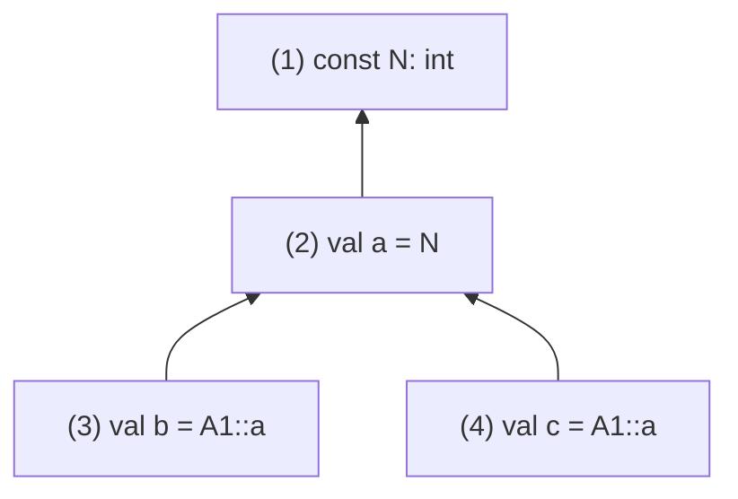
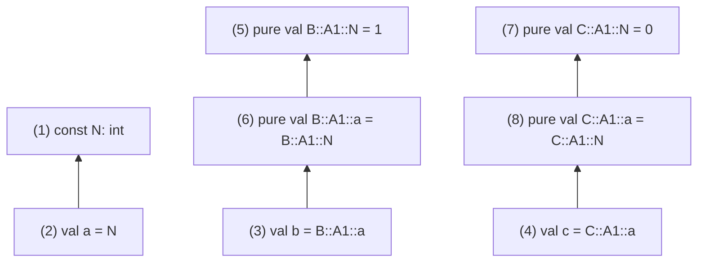

# ADR007: Flattening

| Revision | Date       | Author           |
| :------- | :--------- | :--------------- |
| 1        | 2023-08-01 | Gabriela Moreira |

## 1. Summary

This document describes a new strategy for flattening modules, that is, replacing imports, instances and exports with the actual definitions. This is a necessary step for compilation and integration with apalache, since both the compiler and apalache cannot handle imports, instances and exports.

## 2. Context

Our current strategy for flattening has intrinsic problems, and some issues that popped up cannot really be solved with the current approach. The first of those issues, and perhaps the one that better flags the problem in the current implementation, is [Flatenning breaks when importing by name a definition that depends on others #836](https://github.com/informalsystems/quint/issues/836).

The existing flattener takes import/instance/export statements and replaces them with a copy of the definitions from that module, assigning new ids to those definitions and its inner IR components and adding namespaces when necessary. With this, there are two possible scenarios:

1. All imports, instances and exports include all definitions (i.e. there is no `import A.foo`). In this case, we will end up with a module with all of the definitions from all used modules.
2. There is some statement referring to a specific definition like `import A.foo`. In this case, the other definitions from `A` won't be copied, and if `foo` depends on something else, the flattened module won't be valid.

Therefore, it is clear that we need some way of looking into the dependencies of definitions when copying them over, both to avoid (1) by copying only the necessary definitions, and to avoid (2) and ensure the flattened module has all the definitions it needs.

In addition to that, even though this solution is an exaggeration that generates new ids for all definitions it copies, it still has problems with instances.

See all known problems in [#1071](https://github.com/informalsystems/quint/issues/1071)

## 3. Options

I spent three weeks working on a proof of concept for a new flattener, which is described in this document. During this time, I tried a lot of different combinations of strategies, and none of them were sufficient to make our existing integration tests pass. The requirements I followed to pick solutions was something like these:

1. We need to recurse over definitions being copied to the flattened module until we get all of its dependencies.
2. We need to have different ids for definitions in different instances, so they can assume different values during evaluation.
3. The final flattened module needs to have proper names (i.e. be name resolvable), so Apalache can work with it.

So if there is something that is somehow viable outside of these requirements, I probably didn't consider it.

## 4. Solution

The solution proposed here is a new flattening architecture, which is described in detail in the following sections. The main idea is to have a new flattener that is run twice, with an instance flattener in between. The new flattening procedures require additional information for each definition, so we also propose changes to the name collector in order to gather this information. Therefore, we propose:

1. Changes to name collection, during name resolution
2. Introduction of an instance flattener
3. Changes to the flattener strategy

One important thing to notice is that imports, instances and exports are resolved by the name resolver, and that is where any missing or conflicting name errors are flagged. Flattening assumes all names are present and not conflicting, and the solution proposes a lot of manipulations that rely on this assumption.

To achieve this scenario, we propose:
We describe each change in detail in separate sections below.

### 4.1 Changes to name collection

This section explains the proposed changes to name collection. These changes do not affect name resolution itself, but collect additional metadata, to be used later in flattening:

1. Keep full quint definitions in the lookup table
2. Collect flattened namespaces from import/export/instance statements (adds `namespaces` field)
3. Back-reference the import/export/instance statement that created a definition (adds `importedFrom` field)

We explain each of the changes in detail in the following subsections.

#### `LookupTable` with full quint definitions

Our current lookup table only stores a projection of the quint definition: id (called reference), name and type annotation (if present). There is no strong reason for that, only a premature optimization and the fact that the lookup table values might also be lambda parameters, which are not quint definitions.

In flattening, we need to manipulate and reorganize definitions, and it is much better for performance and readability if the full definitions are in the lookup table, as opposed to having to scan the modules for a definition.

Therefore, we change the lookup table to have either a `QuintDef` or a `QuintLambdaParam` as its value, as well as two additional fields (`namespaces` and `importedFrom`) described below.

#### Collect flattened namespaces from import/export/instance statements (`namespaces`)

When flattening a definition that originates from an import/export/instance statement, we may need to – _only during flattening_ – prefix it with a namespace in order to refer to it uniquely in the flattened module.
This section describes how to accumulate this namespace information during name collection. It is stored in a fresh `namespaces` field, for each definition in the lookup table.

##### Namespaces for imports

Imports are the simplest scenario, since they only copy definitions, possibly adding a namespace to them:
1. `import A.*`, `import A.foo` don't add namespaces
2. `import A` adds `A` namespace
3. `import A as MyA` adds `MyA` namespace

##### Namespaces for instances

For instances, we need to ensure uniqueness, since the same names in the instanced module can assume different values if the constants are different. Therefore, we add `this.currentModuleName` to the namespace, differentiating possible instances with the same name from different modules. For the following cases, suppose the statements are inside the `myModule` module.
1. `import A(N=1).*`  adds a `myModule::A` namespace
  - `myModule` is added to differentiate definitions of this instance from definitions from a similar instance in another module (e.g. `module otherModule { import A(N=2).* }` would have namespace `otherModule::A`)
  - `A` is added to keep consistency with the qualified instance scenario (next item), where the qualifier is necessary. In case of no qualifier (this item), we shouldn't need to add `A`, but having the definitions from `A` namespaced like `myModule::foo` can cause confusion (for us developers while testing and debugging). `myModule::A::foo` is clearer and more consistent with the qualified instance scenario.
2. `import A(N=1) as A1` adds a `myModule::A1` namespace
  - `myModule` is added for the same reason as in (1).
  - `A1` is added to differentiate definitions of this instance from definitions from a similar instance in the same module (e.g. `import A(N=2) as A2` would have namespace `myModule::A2`)

##### Namespaces for exports

Exports have a particularity: they can remove namespaces. Consider the example:
```quint
module A {
  const N: int
  val a = N
}

module B {
  import A(N=1) as A1
  export A1.*
}
```

In this example, `export A1.*` is taking the definitions from `A1` and making them available without any additional namespaces.

This scenario is tricky and, as discussed in a Quint meeting, we could not support it in the first version. Current flattening does support this, but it is not able to distinguish different instances, so problems arise. We are not sure how useful and clear this scenario is for users.

So, exports that change the namespaces of the previously imported definitions are not supported in the first version of the new flattener. We should raise a proper error when an export like that is found. The example above could be rewritten as:
```quint
module A {
  const N: int
  val a = N
}

module B {
  import A(N=1) as A1
  export A1
}
```

Currently, this prevents us from using `A1` without a namespace, since we can't write an export for `import A(N=1).*`. @konnov suggested the introduction of `export *` for this end, which is still in consideration.

#### Back-reference the import/export/instance statement that created a definition (`importedFrom`)

We add a reference to the import/export/instance statement that created a definition, also gathered during name collection, in the new `importedFrom` field. Used in flattening to distinguish definitions that come from instances from definitions that come from imports/exports.

### 4.2 Instance Flattener

The instance flattener gets rid of instances, which is the most complicated part of flattening. We cannot use the same id for the same definition of different instances, as they might assume different values[^1].

Each instance statement is replaced with an import statement and generates a new module. The new module has the constants replaced with `pure val` definitions (from the overrides in the instance statement), and all its names are fully-qualified, constructed with the previously defined namespace algorithm. The new import statement, replacing the instance statement, is a unqualified import of the new module.

The names in the module containing the instance statement also have to be updated with a namespace, since they might refer to definitions that now include a namespace. We look at each name in the module and, if it refers to a definition that comes from an instance, (that is, its `importFrom` field has an instance), then we replace the name with a namespaced version of it (using the `namespaces` field). For this to work properly, any existing `import` and `export` statements should have been flattened before the instance flattener is run, ensuring that the definitions referred to by these names already have their proper namespaces.

All of this tinkering on names and the addition of a matching import statement makes it so the module outputted by the instance flattener can be name resolved. The name resolution of this module will produce a lookup table where the names referring to instances point to the new modules (produced for each instance), which are no longer instances. Therefore, after instance flattening, we have instance-less modules and their corresponding lookup table.

#### Example

Take this module as example, where `A` is instanced twice with the same name:
```quint
module A {
  const N: int // id 1
  val a = N // id 2
}

module B {
  import A(N=1) as A1
  val b = A1::a // id 3
}

module C {
  import A(N=0) as A1
  val C = A1::a // id 4
}
```

The instance flattener will create two new modules: `B::A1` and `C::A1`, with new ids for the definitions inside it.
```quint
module A {
  const N: int // id 1
  val a = N // id 2
}

module B::A1 {
  pure val B::A1::N = 1 // id 5
  pure val B::A1::a = B::A1::N // id 6
}

module C::A1 {
  pure val C::A1::N = 0 // id 7
  pure val C::A1::a = C::A1::N // id 8
}

module B {
  import B::A1.*
  val b = B::A1::a // id 3
}

module C {
  import C::A1.*
  val c = C::A1::a // id 4
}
```

Lookup table before instance flattening:


After instance flattening, there are two independent sub-trees, since both instances are completely independent of each other:


This solution relies mostly in name manipulation: we change the names and let the name resolver restructure the lookup table. In theory, we could keep the original names for the definitions inside the new modules, as long as we properly manipulate the lookup table to have the names related to that instance pointing to the names inside that module. I time-boxed some time to try this and I couldn't do it. The name manipulation solution has a significant cognitive advantage: it is much easier to understand and debug names (which can be pretty-printed) than ids and pointers (that is, the lookup table). As this is already a complex solution, I believe that it makes sense to prioritize the reduction of cognitive load.

##### Override expressions

In an instance statement like `import A(N=e).*`, `e` might depend on expressions defined in the current module. In this case, we need to ensure that the dependencies of `e` are copied to the new module created for the instance, otherwise `pure val myModule::A::N = e` won't resolve. To accomplish this, we use the actual `Flattener` (described below) to inspect only the expressions in the overrides and find any definitions they might depend on.

### Flattener

The flattener adds missing definitions to a module by recursively fetching the lookup table and copying the referenced definition, then looking into that definition for any other names and doing the same. A missing definition is a definition that is referred to by a name in the module, but is not present in that module (because it comes from an import, instance or export statement).

When adding a missing definition, if that definitions carries a namespace, we actually need to do a "deep" procedure to add that name to not only the definition name, but also to every other name appearing in it's body. This includes adding the namespace to lambda parameters and nested definitions (even though they cannot be referred), so flattening doesn't create name conflicts with them.

This deep namespace-adding procedure is already done in the current implementation of flattening (see [`addNamespaceToDef`](https://github.com/informalsystems/quint/blob/main/quint/src/flattening.ts#L276C4-L276C4)), with the only difference being that we don't want to generate new ids in this case (we only create new ids in the Instance Flattener).

### Flattening imports/exports and instances

Our proposed architecture sandwiches one run of the instance flattener (to flatten instances) between two runs of the flattener (to flatten imports/exports):

1. First round of flattening: flattens all imports and exports, leaving us with only instances.
2. Instance Flattener: turns instance statements into imports (and adds a fresh module for each instance)
3. Second round of flattening: flattens the remaining imports created by the Instance Flattener

We use the `importedFrom` field, introduced above, to choose the appropriate step for each definition.

### Overall flattening process

The flattening process is run completely for each module before proceeding to flatten the next module. The modules are assumed to be topologically sorted. The need for running this by module is that we do remove the import statements after we resolve all dependencies, but we can only ensure that all dependencies were flattened if the depending modules were completely flattened before.

The whole flattening process consists of the following steps:
1. Run the Flattener, ignoring definitions that come from instances
2. Remove `import` and `export` statements
3. Run the Instance Flattener
4. Resolve names for the module and its dependencies, obtaining a new lookup table
    - In theory, we should be able to manipulate the lookup table while flattening and avoid this step. However, I believe that would be significantly complex to write and maintain, while I see no outstanding drawbacks in running this step.
5. With the new table and modules, run the Flattener again, this time for all definitions
6. Resolve names again for all modules (using the flattened version for those that are already flattened, and the original version for those that are not). The resulting table is used as the starting point of flattening for the next module, or returned as the final table if this is the last one.
	 - We might be able to manipulate the table inside the flattener so this is not necessary, but it is not obvious how to do that. I believe that the only reason we have to run this now is to update the `importFrom` and `namespaces` fields of definitions coming from instances, since the Instance Flattener replaced instance statements with import statements, and the `importFrom` and `namespaces` fields of the related definitions have to be updated. I have not validated this hypothesis yet.
7. Sort names topologically, since the added definitions might be out of order.
	 - We might also avoid doing this if we add the new definitions in a proper order.

### [Discussion] `FlatModule` and `FlatDef` types

I have not tried this in the proof of concept, but I believe we need to improve our nomenclature and types. This is what we currently use:
- An IR definition (`QuintDef`) is any top level definition, including vars, consts, imports, etc.
- A flat definition (`FlatDef`) is a definition that is not a import, instance or export. All flat definitions have a `.name` field.
- A flat module (`FlatModule`) is a module with only flat definitions
- A definition in the lookup table (`Definition`) is any `QuintDef` or a `QuintLambdaParameter`
- Sometimes, we call `QuintDef` by 'unit' (in the parser and parsing functions such as `parseExprOrUnit`)

I think we should do something like:
- Call this high level definitions that encapsulate everything as 'declarations'.
- `QuintModule` has a list of 'declarations'.
- `QuintDef` should refer only to flat definitions, that is, everything but imports, instances and exports. Those will always have a `.name` field.
- `FlatModule` has a list of `QuintDef`.

## Implementation plan

1. Extract the deep namespace-adding procedure from the current flattener, adding an option to choose whether to generate new ids.
2. Change the lookup table data structure to store the whole `QuintDef` or `QuintLambdaParameter` in its values.
	- This will break integration with apalache. To avoid that, we should either:
		1. Cleanup the produced lookup table in the JSON output so it contains a field called `reference` in the values
		2. Release an apalache version that accepts a lookup table with `id` fields in the values.
	- This also requires a simple update to the `typeAliasInliner`, which now has to operate over different values in the lookup table.
3. Implement the new Flattener
4. Implement the Instance Flattener
5. Use the new flattening process to flatten modules before compiling
6. Make the new flattening process to be done incrementally[^2]

[^1]: In theory, we could use the same id and save some computation for `pure` definitions that don't depend on constants, but that's "future work" :).
[^2]: If it is not a performance issue right now, this is not a priority. It is not super obvious how to do that and it is not covered by the proof of concept.
