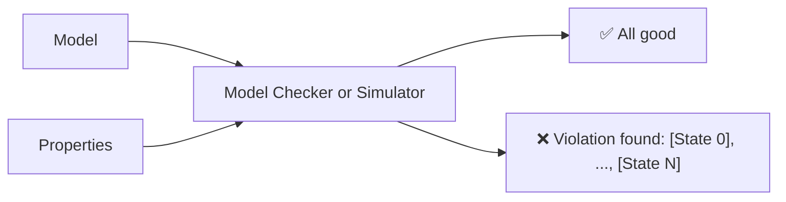
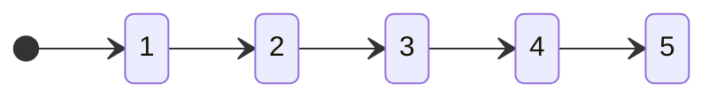

# Quint basics

Quint is a specification language that can be used to describe **models** and **properties**. We can then use either a **model checker** or a **simulator** to see if a model satisfies some properties or not. Whenever a property is violated, the tools provide a **counter-example** describing precisely the sequence of states that lead to the violation of the property, meaning there are no false positives.



Let's look into each of these concepts in more detail.

## Models

Models are transitions systems - more popularly called **state machines**. To define a model, one needs to define **states** and **transitions**. Quint is a language to do that in a powerful way. For instance, if I want to define a state machine where states are numbers from 1 to 5, and there are transitions from each number to it's successor, I could write something like this:
```
States = {1, 2, 3, 4, 5}
Transitions = {1 -> 2, 2 -> 3, 3 -> 4, 4 -> 5}
Initial States = {1}
```

Or, in a visual form:



In Quint, we can use an abstraction and write `x' = x + 1`, which can be read as "x in the next state is equal to x in this state plus one":
```quint
var x: int

action init = x' = 1

action step = x' = x + 1
```

This model would have infinite states, as we don't constraint `x` to be between 1 and 5. If we want this constraint, we can add it:

```quint
var x: int

action init = x' = 1

action step = all {
  x < 5,
  x' = x + 1,
}
```

Learn more about `var`, `action`, `all` and the prime operator (`'`) in [Language Basics](./language-basics.mdx).

## Properties

On top of the model, we can define properties to then see whether they are satisfied for that model. There are two kinds of properties: invariants and temporal.
- Invariants: regular boolean expressions that need to be true for every single state of model.
- Temporal properties: special properties that use temporal operators like `always` and `eventually`.

In the far majority of Quint usage, writing only invariants is enough. Temporal properties are only needed for specific scenarios, so definitely don't start with those. Temporal properties are not supported in the simulator and have partial support in Quint tooling. It is possible to verify temporal properties using Quint through some workarounds.

Let's focus on **invariants**. One potential property for our very simple model from above is "x is always different than 42". Even though it uses the word `always`, this doesn't need a temporal operator, as it is just a simple boolean expression that needs to hold on every single state:
```quint
x != 42
```

And that's it, this is the invariant! We can write more interesting invariants for real specs, such as:
- "It's not the case that something is committed to database A but not to database B" (Transaction Commit)
- "If there are less than 1/3 faulty processes, all correct processes should have agreed on the same value" (Consensus)
- "A smart contract should not have less funds than what it started off with" (No draining funds)

## Model Checker and Simulator

Once you have a model and a property, you can use either the model checker or the simulator to check that property against the model. Model checkers explore *all* possible states of a model, guaranteeing that the property holds for that model, while a simulator will only check a certain number of samples and doesn't provide a guarantee. Even though, the simulator is a great tool to find bugs, and it often provides a faster feedback cycle than a model checker.

There are two model checkers that can be used with Quint:
- Apalache, seamless integrated on `quint verify` calls
- TLC, to be integrated. Using TLC at this point requires transpiling Quint into TLA+ (through `quint compile`).

For more details on these tools, their constraints and the type of guarantees they can provide, see [Model Checkers](./model-checkers.mdx)

Quint ships with a built in simulator, which will run as many random simulations as requested. The simulator is invoked on `quint run` and can also be used for non-deterministic Quint tests that are runned with `quint test`.

Some differences between using a model checker (`quint verify`) and a simulator (`quint run`) for N steps are:
- If there is a property violation in N steps or less, a model checker will find it, while a simulator may or may not find it.
- A model checker will always find the shortest counter-example (as it uses breadth-first search) while a simulator will report the first counter-example it finds, which won't necessarily be the shortest.
- Some features are only available in the simulator and not on the model checker, such as `--mbt` and `--n-traces`.

Read more about the simulator in [Understanding the Simulator](./simulator.mdx).

## Counter-examples

A counter-example is a trace (a sequence of states) that violates a property. Both a model checker and a simulator will always provide a counter-example when an invariant is violated, which means that it is impossible for them to find "false positives" where no violation actually exists. Furthermore, a counter-example is a valuable artifact to understand how the violation happened and to help reproducing that execution on other environments (such as in an integration test for the implementation, or even in production if you are feeling extra courageous). There's a big difference in saying "I think you have a bug in line 65" from "I found a bug, here's a sequence of steps to reproduce it". Quint always does the latter.

A counter-example from Quint looks like this:

```
$ quint run tictactoe.qnt --invariant=XHasNotWon
An example execution:

[State 0]
{
  board:
    Map(
      1 -> Map(1 -> Empty, 2 -> Empty, 3 -> Empty),
      2 -> Map(1 -> Empty, 2 -> Empty, 3 -> Empty),
      3 -> Map(1 -> Empty, 2 -> Empty, 3 -> Empty)
    ),
  nextTurn: X
}

[State 1]
{
  board:
    Map(
      1 -> Map(1 -> Empty, 2 -> Empty, 3 -> Occupied(X)),
      2 -> Map(1 -> Empty, 2 -> Empty, 3 -> Empty),
      3 -> Map(1 -> Empty, 2 -> Empty, 3 -> Empty)
    ),
  nextTurn: O
}

[State 2]
{
  board:
    Map(
      1 -> Map(1 -> Empty, 2 -> Empty, 3 -> Occupied(X)),
      2 -> Map(1 -> Occupied(O), 2 -> Empty, 3 -> Empty),
      3 -> Map(1 -> Empty, 2 -> Empty, 3 -> Empty)
    ),
  nextTurn: X
}

[State 3]
{
  board:
    Map(
      1 -> Map(1 -> Empty, 2 -> Empty, 3 -> Occupied(X)),
      2 -> Map(1 -> Occupied(O), 2 -> Occupied(X), 3 -> Empty),
      3 -> Map(1 -> Empty, 2 -> Empty, 3 -> Empty)
    ),
  nextTurn: O
}

[State 4]
{
  board:
    Map(
      1 -> Map(1 -> Empty, 2 -> Empty, 3 -> Occupied(X)),
      2 -> Map(1 -> Occupied(O), 2 -> Occupied(X), 3 -> Occupied(O)),
      3 -> Map(1 -> Empty, 2 -> Empty, 3 -> Empty)
    ),
  nextTurn: X
}

[State 5]
{
  board:
    Map(
      1 -> Map(1 -> Empty, 2 -> Empty, 3 -> Occupied(X)),
      2 -> Map(1 -> Occupied(O), 2 -> Occupied(X), 3 -> Occupied(O)),
      3 -> Map(1 -> Occupied(X), 2 -> Empty, 3 -> Empty)
    ),
  nextTurn: O
}

[violation] Found an issue (36ms).
Use --verbosity=3 to show executions.
Use --seed=0x8ac91506b011b to reproduce.
error: Invariant violated
```

This command asked Quint to run simulations over the [tictactoe spec](https://github.com/informalsystems/quint/blob/main/examples/games/tictactoe/tictactoe.qnt) and check the `XHasNotWon` invariant, which states that the X player did not win at that state. This the invariant is checked for every single state, in many samples, and Quint's simulator found a sequence of states that lead to a state in which the invariant is not true, because X won (at state 5). By examining the trace, we can see that player O failed to block a diagonal and X was able to complete it and take the win.
