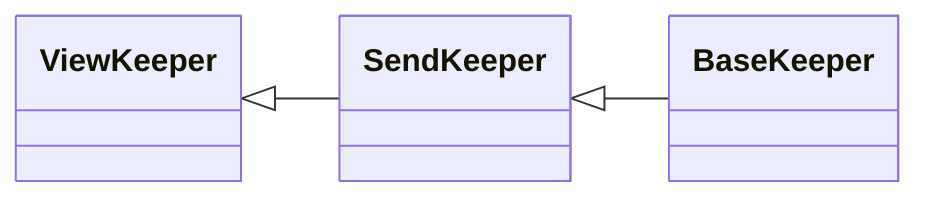

# Onboarding to the module `x/bank` of Cosmos SDK 

**Author**: Igor Konnov, Informal Systems, 2023

**Version**: Cosmos SDK [v0.46.10](https://github.com/cosmos/cosmos-sdk/blob/v0.46.10/).

**This page is still experimental. We believe that Cosmos documentation will
become executable one day.**

## Abstract

This document shows how we could turn an inanimate piece of documentation into
an executable specification. We are using the [bank module][] of Cosmos SDK as
an example. In the following, all of the quoted text belongs to the original
description on the [bank module][] page, unless specified otherwise. To obtain
a Quint module, run [lmt][] against this document. Check the executable
specification in [bank.qnt](./bank.qnt) and [bankTest.qnt](./bankTest.qnt).
We follow the same order of exposition, as in the original document.

Importantly, this description is tuned towards ease of exposition, not for
implementation or verification. Remember that we do not want to make protocols
as complex as their implementation! These are the most illuminating differences:

 - We use abstract data types whenever possible, e.g., big integers, sets, and maps.

 - We abstract error codes to `true` (no error) and `false` (error). The actual
   error codes belong to the implementation details. They are written in comments.

> The bank module is responsible for handling multi-asset coin transfers
> between accounts and tracking special-case pseudo-transfers which must work
> differently with particular kinds of accounts (notably
> delegating/undelegating for vesting accounts). It exposes several interfaces
> with varying capabilities for secure interaction with other modules which
> must alter user balances.
>
> In addition, the bank module tracks and provides query support for the total
> supply of all assets used in the application.

From the engineer's perspective, the bank module looks as follows:

```bluespec bank.qnt +=
// -*- mode: Bluespec; -*-
// An executable specification of the bank module
module bank {
  //----------------------- type declarations -------------------------
  <<<types>>>

  //------- the module logic, that is, the logic of keepers -----------

  <<<functional>>>
}
```

From the protocol designer's point of view, the bank module alone could be
tested by introducing the following non-deterministic state machine:

```bluespec bankTest.qnt +=
// -*- mode: Bluespec; -*-
module bankTest {
  import bank.* from "./bank"

  // the state of the machine that tests the logic
  <<<state>>>

  // state transitions of the machine
  <<<transitions>>>

  // protocol invariants
  <<<invariants>>>

  // tests
  <<<tests>>>
}
```

## Basic protocol types

These are the types that we are using in the protocol specification.
The actual implementation uses different types. **This is not a bug, but a
feature!** By using more abstract types, we make the protocol description
much easier to read and understand.

```bluespec "types" +=
// Addresses are simply strings
type Addr = str
// Denominations are simply strings too
type Denom = str
// 64-bit and 256-bit integers are a special case of big integers.
// We have to take care of the bit width where it matters.
type Int64 = int
type Int256 = int

// the maximum value for Int256 in Golang
pure val MAX_INT256 = 2^256 - 1

// the range of 256-bit integers in the SDK
pure def isInt256(i: int): bool = -2^256 < i and i < 2^256
 
// A coin is a record that contains a denomination and an amount
type Coin = { denom: Denom, amount: Int256 }
// Coins is a map from denominations to amounts
type Coins = Denom -> Int256
// Account balances
type Balance = { address: Addr, coins: Coins }

// A result that is produced by the functions that update the context
type BankResult =
  | BankErr(str)
  | BankOk(BankCtx)

// A result that is produced by the functions that return a coin or panic
type CoinResult =
  | CoinErr(str)
  | CoinOk(Coin)

// A result that is produced by the functions that return a Boolean or panic
type BoolResult =
  | BoolErr(str)
  | BoolOk(bool)

```

**Implementation details.** There are a few important points to be made about
the implementation of the above types in Cosmos SDK:

 - The type `Addr` is implemented with `AccAddress` in
   [address.go](https://github.com/cosmos/cosmos-sdk/blob/v0.46.10/types/address.go), which is `byte[]`.
   It must be a
   [bech32 address](https://docs.cosmos.network/main/spec/addresses/bech32).
   We omit the validation logic in this specification, as it is not relevant
   to the understanding of the banking module.

 - The type `Denom` is implemented in
   [denom.go](https://github.com/cosmos/cosmos-sdk/blob/v0.46.10/types/denom.go). It must match the regular expression `[a-zA-Z][a-zA-Z0-9/:._-]{2,127}`.
   Again, we omit the validation logic in the Quint specification

 - The type `Coin` is implemented in
   [coin.go](https://github.com/cosmos/cosmos-sdk/blob/v0.46.10/types/coin.go).
   Coins must carry non-negative amounts.

 - The type `Coins` is implemented in
   [coin.go](https://github.com/cosmos/cosmos-sdk/blob/v0.46.10/types/coin.go).
   The implementation stores `Coins` as an array `[]Coin`.
   Since an array is not a set, the implementation contains additional
   non-trivial validation logic in
   [Coins.Validate](https://github.com/cosmos/cosmos-sdk/blob/06406f6a70f228bbb6d09b45a4e343477f1ef7e9/types/coin.go#L229)
   to make sure that:

    - The amount assigned to every denomination is positive (that is, `amount > 0`).
    - Coins are sorted in the order of their denominations.
    - There are no duplicate denominations.

## Supply

> The supply functionality:
> 
> passively tracks the total supply of coins within a chain, provides a pattern
> for modules to hold/interact with Coins, and introduces the invariant check to
> verify a chain's total supply.

### Total Supply

> The total Supply of the network is equal to the sum of all coins from the
> account. The total supply is updated every time a Coin is minted (eg: as part
> of the inflation mechanism) or burned (eg: due to slashing or if a governance
> proposal is vetoed).

This is a perfect opportunity to define a state invariant:

```bluespec "invariants" +=
// sum up amounts over all balances for a given denomination
def sumForDenom(denom: Denom): Int256 = {
  balances.keys().fold(0, (sum, addr) => {
    val coins = balances.get(addr)
    if (denom.in(coins.keys())) {
      sum + coins.get(denom)
    } else {
      sum
    }
  })
}

// The total Supply of the network is equal to the sum of all coins from the account
val totalSupplyInv = {
  supply.keys().forall(denom => (sumForDenom(denom) == supply.get(denom)))
}
```

## Module Accounts

SKIPPED, see [Module
accounts](https://docs.cosmos.network/v0.46/modules/bank/#module-accounts).

## State

> The x/bank module keeps state of three primary objects, account balances,
> denom metadata and the total supply of all balances.

The hex value represents the key in the key-value store, that is,
instead of using an ASCIIZ string, Cosmos SDK developers are using a single
byte as a key.

> - Supply: `0x0 | byte(denom) -> byte(amount)`

We represent this field as a map in the protocol specification:

```bluespec "state" +=
// Total supply of coins per denomination
var supply: Denom -> Int256
```

> - Denom Metadata: `0x1 | byte(denom) -> ProtocolBuffer(Metadata)`

> - Balances: `0x2 | byte(address length) | []byte(address) | []byte(balance.Denom) -> ProtocolBuffer(balance)`

We represent this field as a map in the protocol specification:

```bluespec "state" +=
// Balances for each address
var balances: Addr -> Coins
```

For protocol debugging purposes, we introduce a state variable that keeps
the last error message. It makes it easier to write tests. To indicate that
this variable is not, strictly speaking, part of the protocol, we start its
name with underscore:

```bluespec "state" +=
// if non-empty, then it stores the last error message
var _lastError: str
```

We could initialize the state via `init`, which would be similar to executing
genesis transactions in Cosmos:

```bluespec "transitions" +=
// initialize the state machine
action init = all {
  // limit the total supply of burgers and bananas to 10_000
  supply' = Set("banana", "burger").mapBy(d => 10_000),
  // the king has it all
  balances' = Map("king" -> Set("banana", "burger").mapBy(d => 10_000)),
  _lastError' = "",
}

```

## Keepers

> The bank module provides these exported keeper interfaces that can be passed
> to other modules that read or update account balances. Modules should use
> the least-permissive interface that provides the functionality they require.
>
> Best practices dictate careful review of bank module code to ensure that
> permissions are limited in the way that you expect.

### Blocklisting Addresses

> The x/bank module accepts a map of addresses that are considered blocklisted
> from directly and explicitly receiving funds through means such as MsgSend
> and MsgMultiSend and direct API calls like SendCoinsFromModuleToAccount.
>
> Typically, these addresses are module accounts. If these addresses receive
> funds outside the expected rules of the state machine, invariants are likely
> to be broken and could result in a halted network.
>
> By providing the x/bank module with a blocklisted set of addresses, an error
> occurs for the operation if a user or client attempts to directly or
> indirectly send funds to a blocklisted account, for example, by using IBC.

**TODO: we are skipping this feature in the spec for now**

### Common Types

#### Input

> An input of a multiparty transfer

The type in Quint:

```bluespec "types" +=
// An input of a multiparty transfer
type Input = {
  address: str,
  coins: Coins,
}
```

The type in protobuf:

```protobuf
// Input models transaction input.
message Input {
  string   address                        = 1;
  repeated cosmos.base.v1beta1.Coin coins = 2;
}
```

#### Output

An output of a multiparty transfer.

The type in Quint:

```bluespec "types" +=
// An output of a multiparty transfer
type Output = {
  address: str,
  coins: Coins,
}
```

The type in protobuf:

```protobuf
// Output models transaction outputs.
message Output {
  string   address                        = 1;
  repeated cosmos.base.v1beta1.Coin coins = 2;
}
```

### ViewKeeper, SendKeeper, and BaseKeeper

> The base keeper provides full-permission access: the ability to arbitrary
> modify any account's balance and mint or burn coins.
>
> Restricted permission to mint per module could be achieved by using
> baseKeeper with WithMintCoinsRestriction to give specific restrictions to
> mint (e.g. only minting certain denom).

`BaseKeeper` includes plenty of methods. It extends two other interfaces
as follows:



We define the part of the SDK context that is accessed by the bank module:

```bluespec "types" +=
// the portion of the context that is accessed by the bank module
type BankCtx = {
  // block time (needed by vesting accounts)
  blockTime: Int64,
  // accessed via AccountKeeper
  accounts: Set[Addr],
  // the balances are the essential part of the bank module
  balances: Addr -> Coins,
  // module parameters
  params: Params,
}

```

#### ViewKeeper

`ViewKeeper` is extended by `SendKeeper`, extended by `BaseKeeper`.
Its code can be found in [view.go](https://github.com/cosmos/cosmos-sdk/blob/v0.46.10/x/bank/keeper/view.go).

 - `getAllBalances` returns all the account balances for the given account
    address:

```bluespec "functional" +=
/// `GetAllBalances` returns all the account balances for the given account address.
/// https://github.com/cosmos/cosmos-sdk/blob/06406f6a70f228bbb6d09b45a4e343477f1ef7e9/x/bank/keeper/view.go#L61
pure def ViewKeeper::GetAllBalances(ctx: BankCtx, addr: Addr): Coins = {
  if (ctx.balances.keys().contains(addr)) {
    ctx.balances.get(addr)
  } else {
    Map()
  }
}

```

For example, we expect the `GetAllBalances` to return balances in the genesis state as follows:

```bluespec "tests" +=
run getAllBalancesTest = {
  init
    .expect(
      val ctx = stateToCtx(0)
      val kings = ViewKeeper::GetAllBalances(ctx, "king")
      val donkeys = ViewKeeper::GetAllBalances(ctx, "donkeykong")
      and {
        assert(kings.keys() == Set("banana", "burger")),
        assert(kings.get("banana") == 10_000),
        assert(kings.get("burger") == 10_000),
        assert(donkeys.keys() == Set()),
      }
    )
}

// a helper operator that produces a context from a state
def stateToCtx(time: int): BankCtx = {
  {
    blockTime: time,
    accounts: balances.keys(),
    balances: balances,
    params: {
      sendEnabled: Set(),
      defaultSendEnabled: true
    }
  }
}

```

 - `ValidateBalance` validates all balances for a given account address
   returning an error if any balance is invalid. It checks for vesting
   account types and validate the balances against the original vesting
   balances. CONTRACT: ValidateBalance should only be called upon genesis
   state. In the case of vesting accounts, balances may change in a valid
   manner that would otherwise yield an error from this call.

```bluespec "functional" +=
/// `ValidateBalance` should only be called upon genesis state.
/// https://github.com/cosmos/cosmos-sdk/blob/06406f6a70f228bbb6d09b45a4e343477f1ef7e9/x/bank/keeper/view.go#L202
pure def ViewKeeper::ValidateBalance(ctx: BankCtx, addr: Addr): bool = and {
  ctx.accounts.contains(addr),
  val coins = ViewKeeper::GetAllBalances(ctx, addr)
  // Implementation: Coins.IsValid also validates denominations
  coins.keys().forall(denom => coins.get(denom) > 0),
  // TODO: add validation logic for the vesting accounts
}

```

 - `getBalance` returns the balance of a specific denomination
   for a given account by address:

```bluespec "functional" +=
/// GetBalance returns the balance of a specific denomination for a given account by address.
/// https://github.com/cosmos/cosmos-sdk/blob/06406f6a70f228bbb6d09b45a4e343477f1ef7e9/x/bank/keeper/view.go#L98
pure def ViewKeeper::GetBalance(ctx: BankCtx, addr: Addr, denom: str): CoinResult = {
  if (ctx.balances.keys().contains(addr)) {
    val accountBal = ctx.balances.get(addr)
    if (accountBal.keys().contains(denom)) {
      CoinOk({ denom: denom, amount: accountBal.get(denom) })
    } else {
      CoinErr("Unmarshal error")
    }
  } else {
    CoinErr("Unmarshal error")
  }
}

```

 - `HasBalance` returns whether or not an account has at least amt balance:

```bluespec "functional" +=
/// HasBalance returns whether or not an account has at least amt balance.\
/// https://github.com/cosmos/cosmos-sdk/blob/06406f6a70f228bbb6d09b45a4e343477f1ef7e9/x/bank/keeper/view.go#L56
pure def ViewKeeper::HasBalance(ctx: BankCtx, addr: Addr, coin: Coin): BoolResult = {
  // Implementation: panic if the address or denomination are not stored?
  match ViewKeeper::GetBalance(ctx, addr, coin.denom) {
  | CoinOk(c) => BoolOk(c.amount >= coin.amount)
  | CoinErr(msg) => BoolErr(msg)
  } 
}

```

 - `GetAccountsBalances` returns all the accounts balances from the store:

```bluespec "functional" +=
/// GetAccountsBalances returns all the accounts balances from the store.
/// https://github.com/cosmos/cosmos-sdk/blob/06406f6a70f228bbb6d09b45a4e343477f1ef7e9/x/bank/keeper/view.go#L72
pure def ViewKeeper::GetAccountsBalances(ctx: BankCtx): Set[Balance] = {
  // The implementation may panic due to unmarshalling errors.
  // Since these errors are not related to the parameters, we do not propagate them.
  ctx.balances.keys().map(a => { address: a, coins: ctx.balances.get(a) })
}

```

 - `LockedCoins` returns all the coins that are not spendable
   (i.e. locked) for an account by address. For standard accounts, the
   result will always be no coins. For vesting accounts, LockedCoins is
   delegated to the concrete vesting account type.

   **TODO:** This requires vesting accounts.

 - `SpendableCoins` returns the total balances of spendable coins for an
   account by address. If the account has no spendable coins, an empty
   Coins slice is returned.

   **TODO:** This requires vesting accounts.

 - `IterateAccountBalances` iterates over the balances of a single account
   and provides the token balance to a callback. If true is returned from
   the callback, iteration is halted.

   **TODO**

 - `IterateAllBalances` iterates over all the balances of all accounts and
   denominations that are provided to a callback. If true is returned from
   the callback, iteration is halted.

   **TODO**

#### SendKeeper

`SendKeeper` extends `ViewKeeper` and is extended by `BaseKeeper`.
Its code can be found in
[send.go](https://github.com/cosmos/cosmos-sdk/blob/v0.46.10/x/bank/keeper/send.go).

 -  `SendCoins` transfers amt coins from a sending account to a receiving account.
    An error is returned upon failure. At the protocol level, `sendCoins` does not
    update the context in place, but it returns a new context.
    The value `false` is returned in case of error or panic.

<details>
  <summary>Click to see how SendCoins works</summary>

```bluespec "functional" +=
/// SendCoins transfers amt coins from a sending account to a receiving account.
/// An error is returned upon failure.
/// https://github.com/cosmos/cosmos-sdk/blob/06406f6a70f228bbb6d09b45a4e343477f1ef7e9/x/bank/keeper/send.go#L135
pure def SendKeeper::SendCoins(ctx: BankCtx,
    fromAddr: Addr, toAddr: Addr, amt: Coins): BankResult = {
  // Implementation: if Coins are constructed with NewCoins, they must be positive.
  // However, if they are constructed another way, there is no precondition.
  // TODO: checking LockedCoins that deal with vested coins.
  // Safely subtract the coins from fromAddr and add them to toAddr.
  val fromCoins = ViewKeeper::GetAllBalances(ctx, fromAddr)
  if (amt.keys().exists(d =>
      not(d.in(fromCoins.keys())) or fromCoins.get(d) < amt.get(d))) {
    // some denominations do not exist on fromAddr, or there is not enough funds
    BankErr("invalid coins or insufficient funds")
  } else {
    // x/bank invariants prohibit persistence of zero balances
    // clean zero balances
    def getOr0(coins: Coins, d: str): int = if (d.in(coins.keys())) coins.get(d) else 0
    val positiveDenoms = fromCoins.keys().filter(d => fromCoins.get(d) > getOr0(amt, d))
    val subCoins = positiveDenoms.mapBy(d => fromCoins.get(d) - getOr0(amt, d))
    // add coins to toAddr: the tricky part is that the denominations may differ
    val toCoins = ViewKeeper::GetAllBalances(ctx, toAddr)
    // extend the toCoins and amt with zeroes over the joint denominations
    val jointDenoms = toCoins.keys().union(amt.keys())
    // since toCoins and amt held positive values, their sums must be positive too
    val addCoins = jointDenoms.mapBy(d => getOr0(toCoins, d) + getOr0(amt, d))
    if (addCoins.keys().exists(d => addCoins.get(d) > MAX_INT256)) {
      BankErr("overflow")
    } else {
      // add toAddr to the accounts, if it did not exist
      val newAccounts = ctx.accounts.union(Set(toAddr))
      val newBalances =
        if (fromAddr == toAddr) {
          ctx.balances
        } else {
          // Update the balance of fromAddr with subCoins.
          val newBalancesSub = ctx.balances.set(fromAddr, subCoins)
          // Since toAddr may be a new account, extend the map, if needed
          newBalancesSub.put(toAddr, addCoins)
        }
      // succeed with a new balance
      BankOk({ ...ctx, balances: newBalances, accounts: newAccounts })
    }
  }
}

```
</details>

```bluespec "transitions" +=
action send(fromAddr: Addr, toAddr: Addr, coins: Coins): bool = all {
  val ctx = stateToCtx(0)
  val result = SendKeeper::SendCoins(ctx, fromAddr, toAddr, coins)
  match result {
    | BankOk(newCtx) => all {
      balances' = newCtx.balances,
      supply' = supply,
      _lastError' = "",
    }
    | BankErr(msg) => all {
      // We could simply return 'false' here.
      // But we prefer to store the error message instead.
      _lastError' = msg,
      balances' = balances,
      supply' = supply,
    }
  }
}
```

Here is a basic test of `send`:

```bluespec "tests" +=
run sendTest = {
  init
    // the King has bananas and he can send it
    .then(send("king",
               "donkeykong",
               Map("banana" -> 2_000)))
    .expect(and {
      balances.get("king").get("banana") == 8_000,
      balances.get("donkeykong").get("banana") == 2_000,
      balances.get("king").get("burger") == 10_000,
      balances.get("donkeykong").keys() == Set("banana"),
    })
    // Donkeykong does not have any burgers, so this action must fail
    .then(send("donkeykong", "peaches", Set("burger").mapBy(d => 1_000)))
    .expect(_lastError == "invalid coins or insufficient funds")
}
```

 - `InputOutputCoins` performs multi-send functionality. It accepts a series of
   inputs that correspond to a series of outputs. It returns an error if the
   inputs and outputs don't lineup or if any single transfer of tokens fails.

   **TODO**

 - `GetParams` returns the total set of bank parameters.

```bluespec "functional" +=
/// GetParams returns the total set of bank parameters.
/// https://github.com/cosmos/cosmos-sdk/blob/06406f6a70f228bbb6d09b45a4e343477f1ef7e9/x/bank/keeper/send.go#L61
pure def SendKeeper::GetParams(ctx: BankCtx): Params = ctx.params

```

 - `SetParams` sets the total set of bank parameters.

```bluespec "functional" +=
/// SetParams sets the total set of bank parameters.
/// https://github.com/cosmos/cosmos-sdk/blob/06406f6a70f228bbb6d09b45a4e343477f1ef7e9/x/bank/keeper/send.go#L67
pure def SendKeeper::SetParams(ctx: BankCtx, params: Params): BankCtx = {
  { ...ctx, params: params }
}

```

 - `IsSendEnabledCoin` returns the current SendEnabled status of the provided
   coin's denom.

```bluespec "functional" +=
/// IsSendEnabledCoin returns the current SendEnabled status of the provided coin's denom.
/// https://github.com/cosmos/cosmos-sdk/blob/06406f6a70f228bbb6d09b45a4e343477f1ef7e9/x/bank/keeper/send.go#L315
pure def SendKeeper::IsSendEnabledCoin(ctx: BankCtx, coin: Coin): bool = {
  val found = ctx.params.sendEnabled.filter(p => coin.denom == p.denom)
  if (found != Set()) {
    found.exists(p => p.enabled)
  } else {
    ctx.params.defaultSendEnabled
  }
}

```

 - `IsSendEnabledCoins` checks the coins provide and returns an `ErrSendDisabled` if
   any of the coins are not configured for sending. Returns `nil` if sending is enabled
   for all provided coin.

```bluespec "functional" +=
/// IsSendEnabledCoins checks the coins provide and returns an ErrSendDisabled if
/// any of the coins are not configured for sending.  Returns nil if sending is enabled
/// for all provided coin.
/// https://github.com/cosmos/cosmos-sdk/blob/06406f6a70f228bbb6d09b45a4e343477f1ef7e9/x/bank/keeper/send.go#L306C28-L306C28
pure def SendKeeper::IsSendEnabledCoins(ctx: BankCtx, coins: Set[Coin]): bool = {
  // Implementation: return the error ErrSendDisabled on false
  coins.forall(c => SendKeeper::IsSendEnabledCoin(ctx, c))
}
```

 - `BlockedAddr` checks if a given address is restricted from receiving funds.


#### BaseKeeper

`BaseKeeper` extends `SendKeeper`. Its code can be found in
[keeper.go](https://github.com/cosmos/cosmos-sdk/blob/v0.46.10/x/bank/keeper/keeper.go).

**TODO: add the description**

## Parameters

> The bank module contains the following parameters:

| Key	                 | Type            | Example                              |
| -------------------- | --------------- | ------------------------------------ |
| `SendEnabled`        | `[]SendEnabled` | `[{denom: "stake", enabled: true }]` |
| `DefaultSendEnabled` | `bool`          | `true`                               |

### SendEnabled

The send enabled parameter is an array of `SendEnabled` entries mapping coin
denominations to their send_enabled status. Entries in this list take precedence
over the `DefaultSendEnabled` setting.

### DefaultSendEnabled

The default send enabled value controls send transfer capability for all coin denominations unless specifically included in the array of SendEnabled parameters.

### Parameters in Quint

We pack `SendEnabled` and `DefaultSendEnabled` in the record `Params`:

```bluespec "types" +=
// Parameters of the bank module
type Params = {
  // whether coin send is enabled for specific denominations
  sendEnabled: Set[{ denom: str, enabled: bool }],
  // whether coin send is enabled by default
  defaultSendEnabled: bool,
}
```

### Appendix

This part contains technical parts of the specification that are not that
interesting.

```bluespec "state" +=
// all addresses we would like to work with
pure val ADDR = Set("king", "donkeykong", "peaches", "mario")
// all denominations
pure val DENOM = Set("banana", "burger")
```

```bluespec "transitions" +=

action step = any {
  nondet fromAddr = oneOf(ADDR)
  nondet toAddr = oneOf(ADDR)
  nondet denom = oneOf(DENOM)
  nondet amt = (-10).to(supply.get(denom)).oneOf()
  send(fromAddr, toAddr, Set(denom).mapBy(d => amt))
}
```


[bank module]: https://docs.cosmos.network/v0.46/modules/bank/#
[lmt]: https://github.com/driusan/lmt
