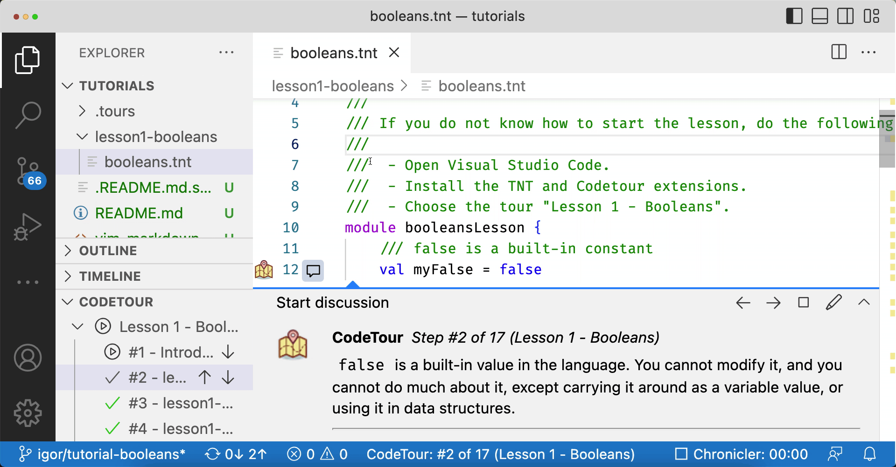

# Learn the language with CodeTour Tutorials

We are introducing language tutorials in two formats.

## 1. Classic markdown

These are simply tutorials written in Markdown. The only thing needed is your
browser. If you want to run the examples in REPL, check how to install
[Quint][].

These tutorials are currently available in the classic format:

 - [Tutorial on integers](./lesson2-integers/integers.md)

## 2. CodeTour tutorials

If you like interactive language tutorials, we have recorded a few using
[CodeTour][]. You have to install two extensions:

 - [Quint VSCode][] is our language extension,
 - [CodeTour][] is the extension of replaying code tutorials.

To start a tour, open the [tutorials](./) folder in VSCode and start the tour:

[Quint]: ../quint/README.md
[Quint VSCode]: https://marketplace.visualstudio.com/items?itemName=informal.quint-vscode
[CodeTour]: https://marketplace.visualstudio.com/items?itemName=vsls-contrib.codetour
